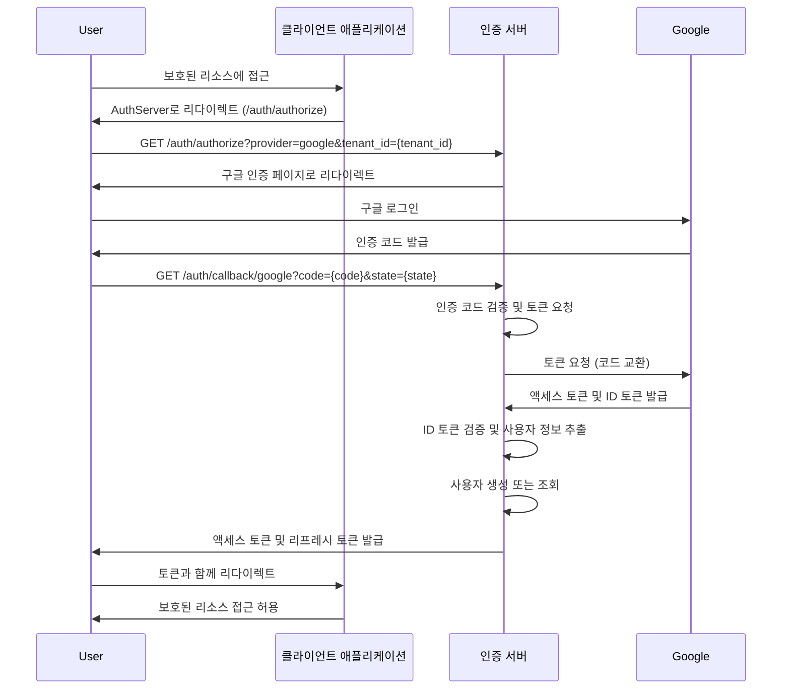
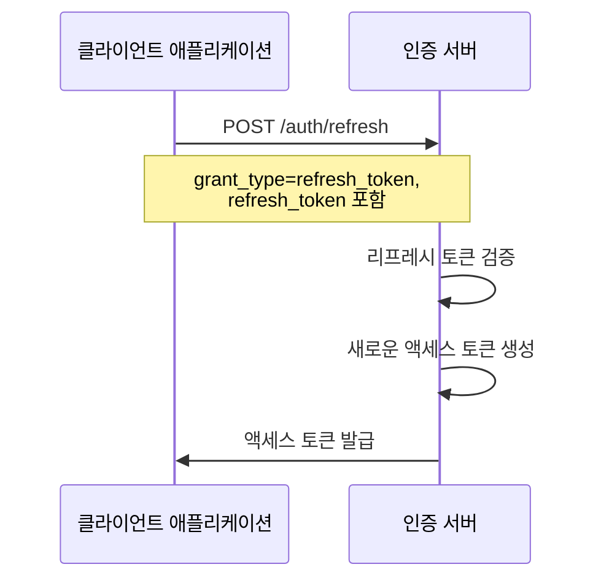
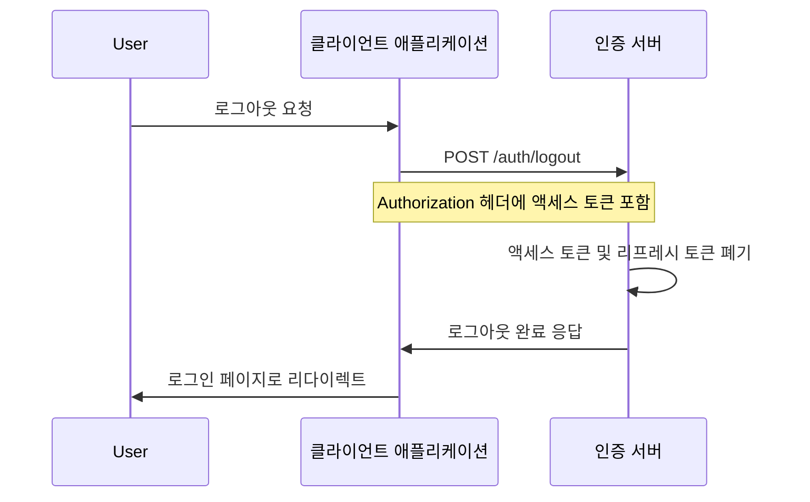
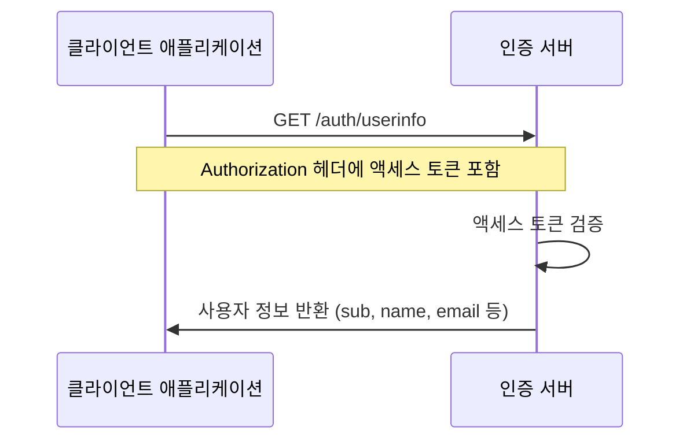
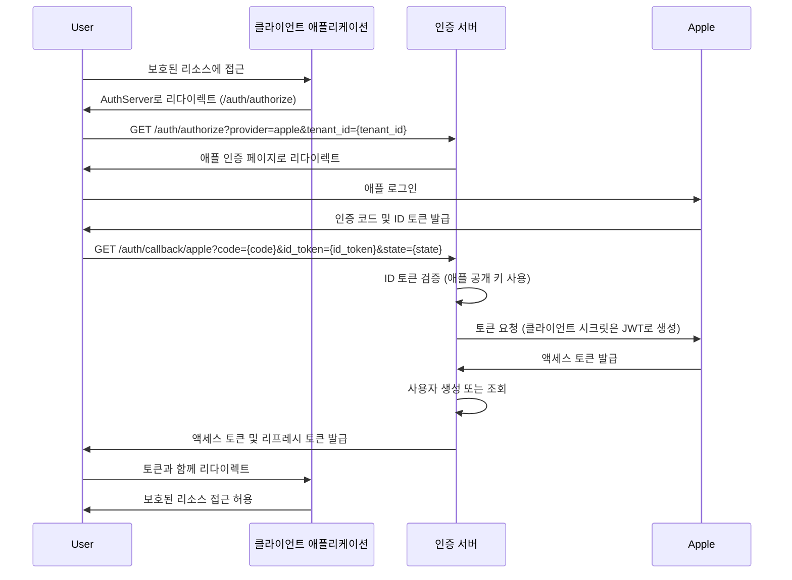
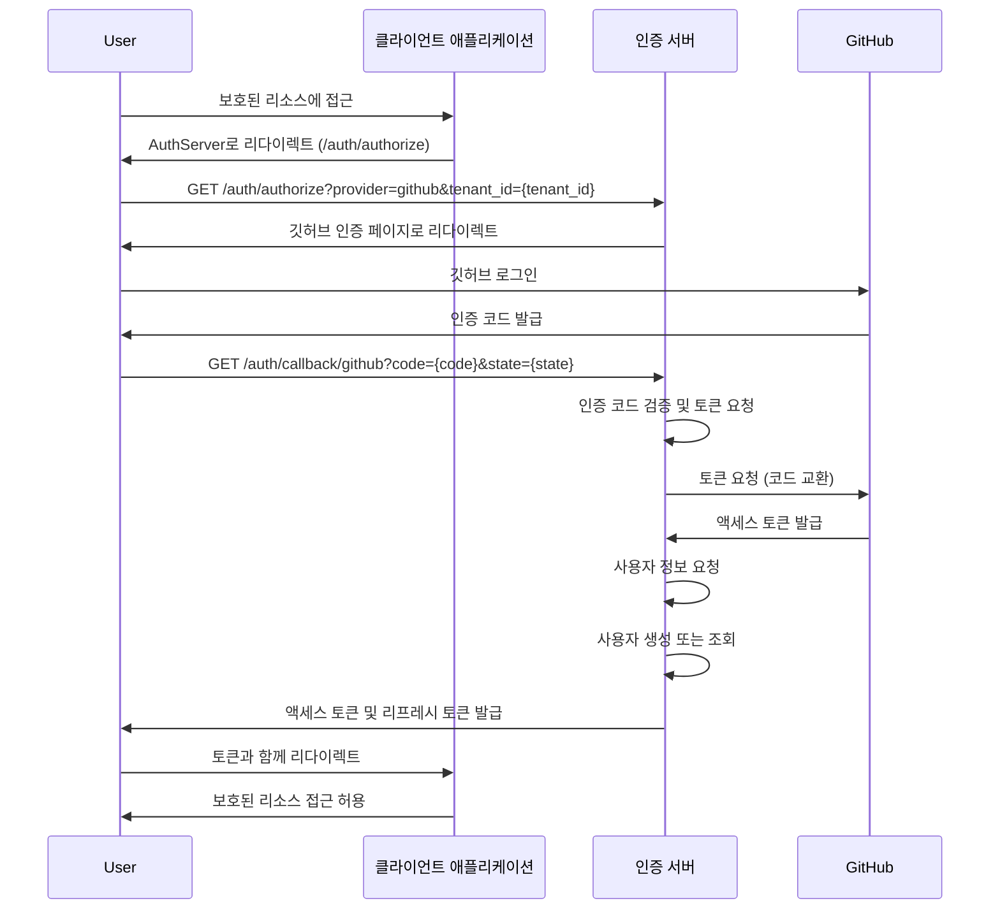
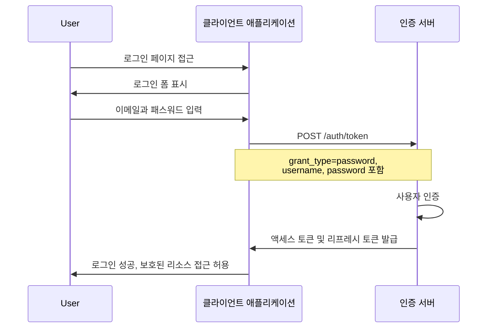
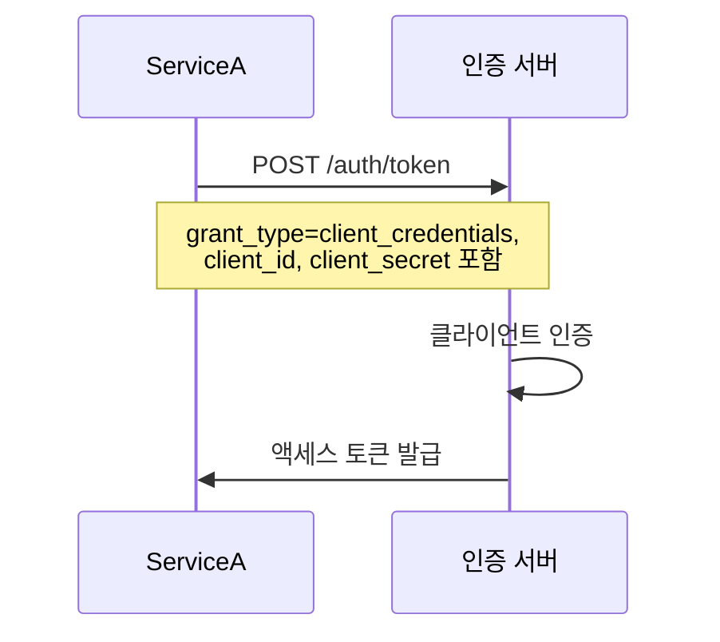
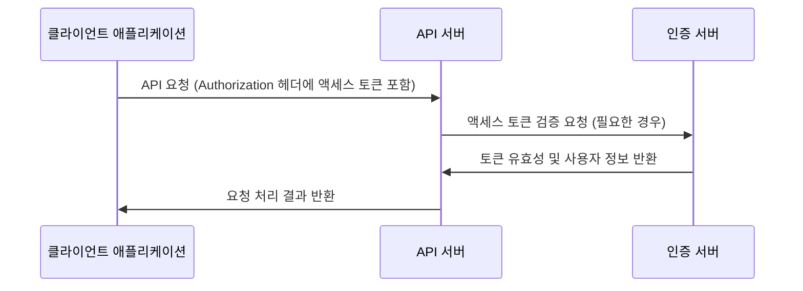
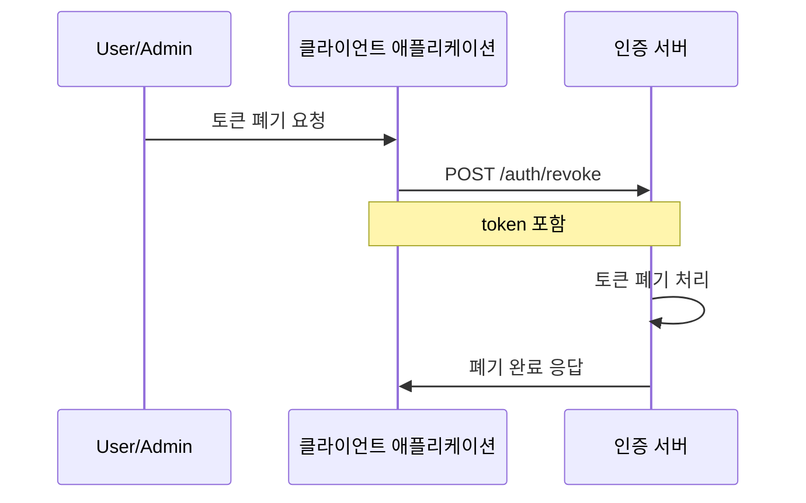

확인했습니다! 아래에 중앙 집중식 인증 서버를 호출하는 다양한 케이스에 대한 시퀀스 다이어그램을 제공하겠습니다. 이 다이어그램들은 소셜 로그인(구글, 깃허브, 애플)을 통한 인증, 토큰 발급 및 갱신, 로그아웃 등의 흐름을 포함합니다.

---

## **1. 소셜 로그인 인증 흐름 (구글 예시)**

사용자가 구글을 통한 소셜 로그인을 사용하는 경우의 인증 흐름입니다.

---

## **2. 토큰 갱신 흐름**

리프레시 토큰을 사용하여 새로운 액세스 토큰을 발급받는 흐름입니다.

---

## **3. 로그아웃 흐름**

사용자가 로그아웃하여 세션을 종료하는 흐름입니다.

---

## **4. 사용자 정보 조회 흐름**

액세스 토큰을 사용하여 사용자 정보를 조회하는 흐름입니다.

---

## **5. 애플 로그인 인증 흐름**

애플 로그인은 OAuth 2.0과 OpenID Connect 표준을 완전히 따르지 않으므로, 특수한 처리가 필요합니다.

---

## **6. 깃허브 로그인 인증 흐름**

깃허브를 통한 소셜 로그인 흐름입니다.

---

## **7. 로컬 로그인 인증 흐름 (선택 사항)**

이메일과 패스워드를 사용한 자체 로그인 흐름입니다.

---

## **8. 클라이언트 크리덴셜 흐름 (서비스 간 인증)**

서비스 간 통신을 위한 클라이언트 크리덴셜 흐름입니다.

---

## **9. 액세스 토큰 검증 흐름**

API 서버에서 액세스 토큰을 검증하는 흐름입니다.

---

## **10. 토큰 폐기 흐름**

사용자 또는 관리자가 토큰을 폐기하는 흐름입니다.

---

위의 시퀀스 다이어그램들은 중앙 집중식 인증 서버와 다양한 주체들(사용자, 클라이언트 애플리케이션, 외부 인증 제공자) 간의 상호 작용을 시각화한 것입니다. 각 흐름은 요구사항 문서에서 언급된 주요 기능들을 반영하고 있습니다.

**참고사항:**

- 실제 구현에서는 **보안 강화**를 위해 CSRF 토큰 관리, 입력 값 검증, 에러 처리 시 민감한 정보 노출 방지 등이 추가로 필요합니다.
- **상태(`state`) 및 논스(`nonce`)** 등의 파라미터를 사용하여 보안 공격에 대비해야 합니다.
- **에러 처리 흐름**은 다이어그램에서 생략되었지만, 실제 구현 시에는 다양한 에러 상황에 대한 처리도 고려해야 합니다.

---

추가로 궁금하신 점이나 특정 흐름에 대한 상세한 설명이 필요하시면 언제든지 말씀해 주세요!
